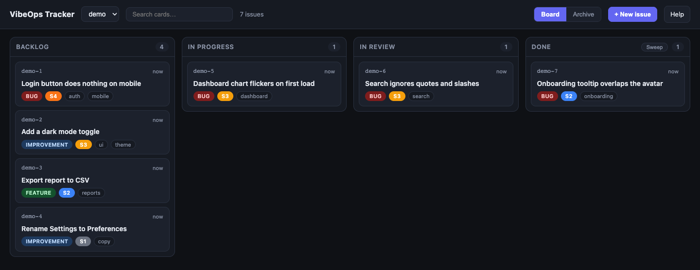
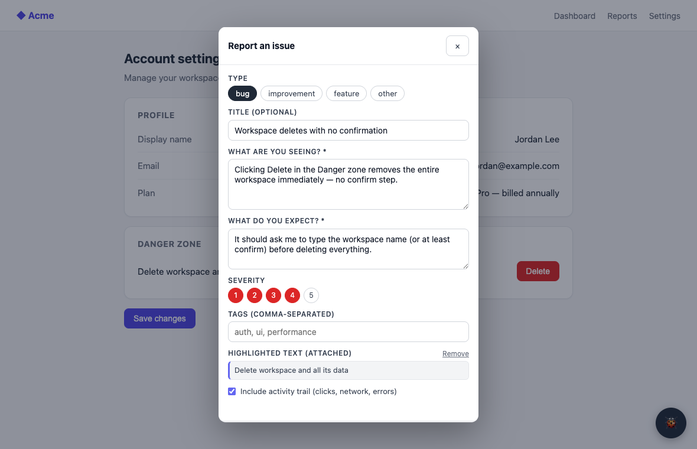

# VibeOps Tracker

**A local-first issue tracker for builders juggling a dozen projects at once.**
Capture a bug or idea the moment you spot it, prioritize it on a Kanban board,
and hand it to AI coding agents. Everything runs on your machine, nothing in the
cloud.

[](LICENSE)
[](https://www.npmjs.com/package/vibeops-tracker)
[](https://github.com/igembitsky/vibeops-tracker/actions/workflows/ci.yml)

[](CONTRIBUTING.md)

When you build several things at once, the work that breaks your flow isn't the
big feature. It's the steady drip of small ones. You're testing a side project,
you notice a misaligned button, a missing validation, a "wouldn't it be nice."
Stop to fix each one and you never finish anything; open a tab to track it and
the idea rots in a list you never reopen. VibeOps Tracker is the place to **put
it down and keep moving**, then pick it up, prioritize it, and ship it (or let
an agent ship it) when the time is right.

It runs entirely on your machine. No account, no telemetry, no cloud. Your
issues are plain markdown files in a folder you control.



## Quickstart

```bash
npx vibeops-tracker          # board at http://localhost:4400
```

That's it. No install, no config, no database. Prefer to clone it?

```bash
git clone https://github.com/igembitsky/vibeops-tracker.git
cd vibeops-tracker
npm install
npm start                    # board at http://localhost:4400
```

Requires Node 20+. Your data lives in a local `data/` folder (when cloned) or
your OS app-data directory (when installed globally). Run `vibeops where` to
see exactly where.

## Three ways to capture

The whole point is to make capturing an issue cheaper than the urge to ignore
it. So there are three on-ramps, and you can mix them freely:

**1. From any running app, with the widget.** Drop one line into a project's HTML:

```html
<script src="http://localhost:4400/widget.js" data-project="my-app" defer></script>
```

A floating 🐞 button appears. Highlight the thing you're talking about, click
the button, and the issue is captured with the selected text plus a context
snapshot: the URL, the viewport, and (for bugs) an activity trail of your last
clicks, network calls, and JavaScript errors. The widget never breaks the host
app: if the tracker is down, it fails quietly and keeps your typed text.

Optionally, tell the widget about app state the URL doesn't carry (active tab,
selected record id, git branch) with
`window.IssueTracker.configure({ context: () => ({...}) })`; whatever the
function returns at capture time is attached to the issue. Keep it to a few
keys of JSON, pointers rather than data dumps, and never secrets or PII.



**2. From a Claude Code session, over MCP.** Register the tracker once as an
MCP server (below), and any agent session can file an issue mid-task when it
notices something out of scope. Or you can just say "add that to the backlog."

**3. From the board itself.** Click **+ New issue** to file something directly,
no widget required.

## The board

Open `http://localhost:4400` and you get a Kanban board across all your
projects, with a switcher to move between them:

- **Five columns:** Backlog → On Deck → In Progress → In Review → Done. Backlog is
  your triage pool; promote items to **On Deck**, the curated queue agents pull from.
- **Drag to prioritize.** Card order is saved to each issue's file, so agents
  see the same priority you do.
- **Real-time search** filters cards as you type.
- **Click to edit** an issue's type or severity right on the card detail.
- **Sweep** finished work into a searchable **Archive**, and **delete** stale or
  test issues outright (with a two-step confirm).
- **Icebox** a backlog item to park it off the board, then bring it back to the
  Backlog when the time is right. Iceboxed items also drop off agents' `list_issues`.
- **Copy Prompt** turns any issue into a paste-ready Claude Code prompt: the
  full description, the captured context, the repo path, and the workflow.

## Let agents work the backlog

This is the part that makes it *ops*, not just a list. Register the tracker as
an MCP server, available in every Claude Code session:

```bash
claude mcp add vibeops -- npx -y -p vibeops-tracker vibeops-mcp
```

Now your agents can read and drive the board directly. The intended loop:

1. You triage the backlog during the day and promote the items you want worked to **On Deck**.
2. When you step away, you point an agent at it: *"Work my-app's On Deck and stop for my review."*
3. The agent calls `list_issues` for On Deck, picks the highest-priority one, marks it
   **In Progress**, does the work, and moves it to **In Review** with a
   summary of what it changed and which files it touched.
4. You come back to a board that shows exactly what got done, ready to verify.

Agents set every status except **Done**. That one is yours, so nothing ships
without your sign-off. The MCP server reads the markdown store directly, so it
works even when the web UI isn't running.

**Tools:** `get_tracker_instructions`, `list_projects`, `list_issues`,
`search_issues`, `get_issue`, `create_issue`, `update_issue`, `add_comment`,
`resolve_issue`, `icebox_issue`, `revive_issue`, `delete_issue`.

## How it stores things

One issue is one markdown file under `data/<project>/issues/`:

```markdown
---
id: my-app-7
project: my-app
title: Login button does nothing on mobile
status: backlog
type: bug
severity: 4
tags: [auth, mobile]
---

## Seeing
Tapping "Log in" on iOS Safari does nothing.

## Expecting
It submits the form and signs me in.

## Context
The captured snapshot (URL, selected text, recent errors), stored as JSON.
```

Human-readable, AI-readable, greppable, and versionable. The store handles
concurrent writes from the web server and the MCP server with file locks, so the
board and your agents never corrupt each other's edits.

## Configuration

Everything has a sensible default; override only what you need.

| Setting    | Default                              | How to set                          |
| ---------- | ------------------------------------ | ----------------------------------- |
| Port       | `4400`                               | `--port 5000` or `PORT=5000`        |
| Data dir   | `./data` (clone) or OS app-data dir  | `--data <dir>` or `DATA_DIR=<dir>`  |

```bash
vibeops                 # start the board (default command)
vibeops --port 5000     # on a different port
vibeops where           # print the data directory
vibeops mcp             # run the MCP stdio server directly
vibeops --help
```

### Keep it running (macOS)

A tracker started from a terminal tab (or an agent session) dies when that tab
closes. To make it a permanent fixture instead:

```bash
vibeops service install     # starts at login, restarts if it ever dies
vibeops service status
vibeops service uninstall
```

This registers a per-user launchd agent, so there is nothing to remember to
start. It pins the current Node binary and checkout path into the agent, so
re-run `install` after upgrading Node or moving the repo. Logs go to
`~/Library/Logs/vibeops-tracker.log`. On Linux, run `vibeops` under a systemd
user unit with `Restart=always`.

## FAQ

**Is my data private?** Yes, completely. Everything lives on your machine in
local files. There's no account, no server you don't run, and no telemetry. The
board binds to `localhost` only, so don't expose its port to an untrusted network
(see [SECURITY.md](SECURITY.md)).

**Do I have to use AI agents?** No. The widget, the board, and the Copy Prompt
button are useful on their own. MCP is opt-in.

**Does it lock me into one project?** No. It's built for the opposite. One
tracker holds all your projects, each with its own board, and the widget installs
into any of them with a single line.

**What does a project need to integrate?** One `<script>` tag. That's the only
tracker code that ever lives in your project; everything else stays here.

**Why markdown files instead of a database?** So your backlog is readable,
greppable, diffable, and yours. No migration, no lock-in, no service to keep
alive.

## Contributing

Issues and pull requests are welcome. See [CONTRIBUTING.md](CONTRIBUTING.md)
for setup and the project layout, and [CODE_OF_CONDUCT.md](CODE_OF_CONDUCT.md)
for the ground rules. It's a small, dependency-light codebase (plain ESM, no
build step), meant to be easy to read and easy to change.

## License

[MIT](LICENSE) © Igor Gembitsky

---

## Why I built this

I build a lot of things at once. Testing them locally, I'd constantly trip over
small bugs and half-formed ideas at the worst possible moment, mid-flow on
something else. Fixing each one on the spot wrecked my focus. Spinning up a
separate session for every one wasn't worth it when I'm the only one driving.
What I wanted was somewhere to *triage*: drop the bug, the feature, the
"improve this later," keep building, and come back to a prioritized stack I could
work through myself or hand to an agent on a coffee break.

I looked at the existing tools and they were all built for teams, for the cloud,
or for ceremony I didn't want. So I built the small, local, private thing that
fit how I actually work, and figured other people building solo might want it
too. That's what this is: my "vibe ops," a lightweight backbone for managing
the work behind a pile of side projects. Take it, use it, change it, and tell me
how to make it better.
